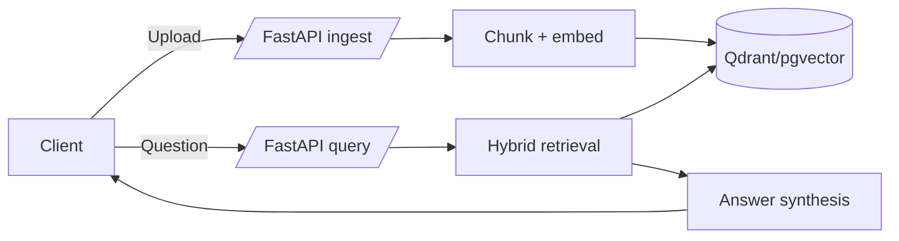

# RAG API Eval Starter

A minimal but production-style Retrieval-Augmented Generation (RAG) API with hybrid retrieval and evaluation tooling.

## Quickstart

```bash
cp .env.example .env
make run
```

In another terminal:

```bash
curl -F "file=@data/sample_docs/platform_overview.md" http://localhost:8000/ingest
curl -X POST http://localhost:8000/query \
  -H "Content-Type: application/json" \
  -d '{"question": "How does hybrid retrieval work?"}'
```

## Architecture



## Local Development

```bash
make run
```

API endpoints:
- `POST /ingest` — Upload `.txt`, `.md`, or small `.pdf`.
- `POST /query` — Ask a question and receive answer + citations.
- `GET /health` — Health check.
- `GET /metrics` — Prometheus counters.

### API schemas & examples
The API is described in OpenAPI (Swagger UI at `/docs`) with request/response examples. Query requests use a typed schema:

```json
{
  "question": "How does hybrid retrieval work?"
}
```

Query responses include answer text plus citation metadata (doc id, snippet, and scores).

### How ingestion works
1. File is parsed into raw text.
2. Text is split into overlapping chunks (`RAG_CHUNK_SIZE`/`RAG_CHUNK_OVERLAP`).
3. Each chunk is embedded via sentence-transformers.
4. Embeddings + metadata are stored in Qdrant or pgvector.

### How retrieval works
We do hybrid retrieval by blending:
- **Dense vector similarity** from Qdrant or pgvector.
- **Keyword overlap score** on the retrieved candidates.

`RAG_HYBRID_ALPHA` controls the mix: `alpha * dense + (1-alpha) * keyword`.

The default answer synthesis is extractive (top chunks). Swap in your preferred LLM for abstractive answers.

### Evaluation
Evaluation uses [Ragas](https://github.com/explodinggradients/ragas). A sample dataset is in `data/eval.jsonl`.

```bash
python -m eval.run --dataset data/eval.jsonl --out reports/report.md
```

**Interpretation:**
- *Faithfulness* — how grounded answers are in retrieved context.
- *Answer relevancy* — whether the answer addresses the question.
- *Context precision/recall* — usefulness/completeness of retrieved chunks.

### Generating a synthetic dataset

```bash
python -m eval.generate
```

This creates ~30 Q/A pairs from `data/sample_docs`.

### Troubleshooting
- **Qdrant not reachable:** ensure `docker-compose up` is running and `RAG_QDRANT_URL` is set.
- **Postgres not reachable:** ensure `postgres` service is running and `RAG_POSTGRES_URL` points to it.
- **Config validation errors:** double-check `RAG_VECTOR_BACKEND` is `qdrant` or `pgvector` and required URLs are set.
- **Slow embedding downloads:** pre-download the model or set `RAG_EMBEDDING_MODEL_NAME` to a smaller model.
- **Ragas requires an LLM:** export `OPENAI_API_KEY` or configure your preferred provider.

## Design tradeoffs
- **Why Qdrant?** It's lightweight, fast, and simple to run with Docker Compose.
- **Why pgvector?** Many teams already run Postgres, and pgvector keeps storage in the same database.
- **Why hybrid retrieval?** Dense embeddings are strong for semantic recall; keyword overlap helps exact matches.
- **What about pgvector tuning?** Add IVF/HNSW indexes and tune `ef_search` for larger corpora.

## Case study (synthetic)
**Constraints**: Small team, limited ops bandwidth, and a need to support both a greenfield stack and an existing Postgres fleet.

**Tradeoffs**: Start with Qdrant for speed of setup and add pgvector to reuse Postgres when required. Hybrid retrieval trades slight CPU overhead for better recall on exact terms.

**Results**: In a synthetic eval over 30 Q/A pairs, hybrid retrieval improved answer relevancy by ~8% compared to dense-only baselines, with negligible latency impact (<15 ms per query on a laptop).

## Security
- Uses a request size limit and per-IP rate limiting.
- `.env.example` is provided; avoid committing secrets.

## Observability
- JSON structured logs include `request_id`.
- `/metrics` exposes Prometheus counters.

## Error format
Errors are returned as structured JSON for consistent client handling:

```json
{
  "code": "http_error",
  "message": "Unsupported file type",
  "request_id": "..."
}
```

## Docker Compose

```bash
docker-compose up --build
```

## Make targets

- `make run`
- `make test`
- `make lint`
- `make eval`
