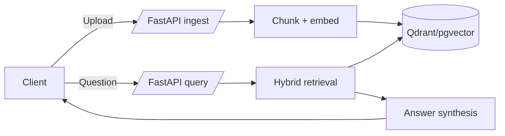

# RAG API Eval Starter


A minimal but production-style Retrieval-Augmented Generation (RAG) API with hybrid retrieval and evaluation tooling.

## Quickstart

```bash
python -m venv .venv
source .venv/bin/activate
make setup
make run
```

Then in another terminal:

```bash
curl -F "file=@data/sample_docs/platform_overview.md" http://localhost:8000/ingest
curl -X POST http://localhost:8000/query \
  -H "Content-Type: application/json" \
  -d '{"question": "How does hybrid retrieval work?"}'
```

## Demo (1-minute evaluable)

The demo is now an undeniable end-to-end flow:

```bash
make demo
```

It will:
1. Start the API (`docker compose up` when available; otherwise `uvicorn`).
2. Ingest a tiny corpus from `data/sample_docs/`.
3. Run 3 example queries.
4. Print answer text, cited chunk IDs, and per-query latency.

> For fast local demo mode, `uvicorn` is started with `RAG_FAKE_EMBEDDINGS=1` to avoid model downloads.

## Architecture



## Development

```bash
python -m venv .venv
source .venv/bin/activate
make setup
pre-commit install
```

Common commands:
- `make lint`
- `make typecheck`
- `make test`
- `make demo`
- `make eval`
- `make eval-ci`
- `make fmt`

## Testing / CI

CI (`.github/workflows/ci.yml`) runs on push and pull requests:
1. `make lint`
2. `make typecheck`
3. `make test`
4. `make eval-ci` (tiny deterministic eval set)
5. Docker Compose config validation when Docker is available

## Evaluation Harness

Run a tiny deterministic evaluation on 10 Q/A pairs:

```bash
make eval
```

This writes `reports/latest.md` with:
- hit rate / recall@k
- rubric score (top-1 contains expected answer)
- latency p50/p95

## Quality Gates

Metrics tracked by CI (`make eval-ci`):
- Hit rate
- Recall@k
- Rubric score (top-1 contains expected answer)
- Latency p95

Current fail thresholds:
- `hit_rate < 0.50` → fail
- `rubric_score < 0.40` → fail
- `latency_p95_ms > 250` → fail

## Tradeoffs

- **Chunking**: fixed-size chunks with overlap are simple and fast, but can split semantically related content across boundaries.
- **Embedding model**: `all-MiniLM-L6-v2` is lightweight and good for starter quality; larger models may improve recall at higher cost.
- **Reranking**: current hybrid scoring blends dense similarity and keyword overlap for speed; adding a cross-encoder reranker improves relevance but increases latency.

## Troubleshooting

- **Qdrant not reachable:** set `RAG_QDRANT_URL` or run without it for in-memory mode.
- **Postgres not reachable:** ensure `postgres` service is running and `RAG_POSTGRES_URL` points to it.
- **Config validation errors:** verify `RAG_VECTOR_BACKEND` is `qdrant` or `pgvector`.
- **Slow embedding downloads:** use `make demo` which runs fake embeddings in uvicorn mode.
- **Pre-commit issues:** run `pre-commit run --all-files` and commit the fixes.
