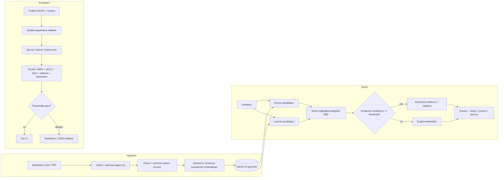

# RAG API Eval Starter — retrieval quality gates

[](https://github.com/aelsaeed/rag-api-eval-starter/actions/workflows/ci.yml)

**Retrieval regressions fail CI.** This project is a compact FastAPI retrieval service that makes
ranking, evidence, citation, and abstention quality testable before a change is deployed.

Version 0.2 builds independent dense and lexical candidate lists, combines them with score-calibrated
weighted reciprocal-rank fusion (RRF), and returns the evidence and component metadata behind each
answer. The default profile is deterministic and offline so a reviewer can reproduce the same
application-level benchmark without downloading a model or provisioning a database.

## Evidence first

A fresh local run of the v0.2 deterministic benchmark produced the following strategy ablation on 20
August 2026. The dataset contains 12 cases (10 answerable and two hard negatives) and has SHA-256
`9fa78a7a37fef0b330a0e8bf79071c3d46eeb4108d09bde5821d4cd6acf2926d`.

| Strategy | Recall@1 | Recall@3 | Recall@5 | MRR@5 | nDCG@5 | Fact coverage | Citation precision | Abstention accuracy |
|---|---:|---:|---:|---:|---:|---:|---:|---:|
| Dense | 0.300 | 1.000 | 1.000 | 0.600 | 0.702 | 0.033 | 0.000 | 0.417 |
| Lexical | 1.000 | 1.000 | 1.000 | 1.000 | 1.000 | 1.000 | 0.850 | 1.000 |
| Hybrid | 0.900 | 1.000 | 1.000 | 0.950 | 0.963 | 1.000 | 0.850 | 1.000 |

Hybrid is a large improvement over the dense baseline and passes every configured gate. Lexical is
stronger on this deliberately small, literal corpus; that is useful evidence, not something to hide.
The ablation keeps each component visible and prevents a universal “hybrid is always better” claim.
These are local deterministic results, not a claim about a green remote run or broad production
quality. See [evaluation methodology](docs/evaluation.md) for scoring and limitations.

## What is implemented

| Risk | Implementation | Evidence |
|---|---|---|
| A healthy API can retrieve the wrong context | Versioned golden cases and application-level Recall@k, MRR, and nDCG gates | `make eval-ci` exits non-zero below any hybrid threshold |
| Dense search can miss an exact term | Independent dense and lexical searches with weighted RRF | Per-strategy ablation and component ranks/scores in every citation |
| Weak evidence can produce a confident-looking answer | Configurable relevance threshold and explicit abstention | Two hard negatives and abstention accuracy gate |
| A unit-only evaluator can drift from the service | Adapter uses real ingestion, storage, retrieval, and answer code | Isolated in-memory store and explicit settings |
| A demo can depend on a model or local service | Hashed embeddings and in-memory Qdrant by default | Offline `make demo` and deterministic CI profile |
| Operational failures can be hidden | Liveness, storage-backed readiness, JSON logs, request IDs, and Prometheus metrics | API/container smoke tests and `/ready` polling |

The response is **extractive evidence**, not free-form LLM generation. That boundary keeps grounding
measurable and is listed explicitly under [limitations](#limitations).

## One-command demo

Install the development environment once:

```bash
python -m venv .venv
source .venv/bin/activate
make setup
```

Then run the complete offline flow:

```bash
make demo
```

The script starts a temporary local API, waits for storage-backed readiness, ingests the sample
corpus, runs three hybrid queries, prints confidence/candidate/source metadata, and cleans up only the
process it created. It uses deterministic hashed embeddings and in-memory Qdrant.

Choose another address with `API_URL=http://127.0.0.1:8100 make demo`. Docker is opt-in:

```bash
DEMO_RUNTIME=docker make demo
```

Docker mode requires the Compose v2 plugin, starts an isolated project, and removes that project's
containers and volumes when the demo ends.

## Architecture


```mermaid
flowchart LR
    subgraph Ingestion
        D[Markdown / text / PDF] --> G[Limits + optional ingest key]
        G --> C[Parse + sentence-aware chunks]
        C --> E[Hashed or sentence-transformer embeddings]
        E --> S[(Qdrant or pgvector)]
    end

    subgraph Query
        Q[Question] --> DR[Dense candidates]
        Q --> LR[Lexical candidates]
        S --> DR
        S --> LR
        DR --> RRF[Score-calibrated weighted RRF]
        LR --> RRF
        RRF --> T{Evidence confidence >= threshold?}
        T -->|yes| A[Extractive evidence + citations]
        T -->|no| X[Explicit abstention]
        A --> M[Answer + ranks + scores + latency]
        X --> M
    end

    subgraph Evaluation
        GD[Golden JSONL + corpus] --> AD[Isolated application adapter]
        AD --> ST[Dense / lexical / hybrid runs]
        ST --> QM[Recall + MRR + nDCG + facts + citations + abstention]
        QM --> CI{Thresholds pass?}
        CI -->|no| F[Fail CI]
        CI -->|always| AR[Markdown / JSON artifacts]
    end
```

FastAPI lifespan owns the selected store, blocking embedding/storage operations run in a thread pool,
and ingestion uses content-derived document IDs so identical bytes replace the same document.

## API walkthrough

Start the server:

```bash
make run
```

Ingest a supported document (`.md`, `.txt`, or `.pdf`):

```bash
curl --fail --silent --show-error \
  -F "file=@data/sample_docs/platform_overview.md" \
  http://127.0.0.1:8000/ingest
```

If `RAG_INGEST_API_KEY` is set on the server, add `-H "X-API-Key: $RAG_INGEST_API_KEY"`.
The returned `doc_id` is derived from the document bytes.

Query with an explicit retrieval strategy and depth:

```bash
curl --fail --silent --show-error \
  -X POST http://127.0.0.1:8000/query \
  -H "Content-Type: application/json" \
  -d '{
    "question": "Which metrics are exposed in Prometheus format?",
    "strategy": "hybrid",
    "top_k": 3
  }'
```

A response includes extractive evidence, auditable citations, and retrieval metadata (example values
are abridged):

```json
{
  "answer": "Answer (extractive evidence):\n- Metrics are exposed in Prometheus format and count total ingest requests, query requests, errors, abstentions... [observability.md]",
  "citations": [
    {
      "doc_id": "871d9cbce76bf8c4bfbcbca827e3a1b3",
      "chunk_id": "871d9cbce76bf8c4bfbcbca827e3a1b3-0",
      "snippet": "Metrics are exposed in Prometheus format and count total ingest requests, query requests, errors, abstentions...",
      "score": 0.8984,
      "evidence_score": 1.0,
      "dense_score": 0.4196,
      "keyword_score": 1.0,
      "dense_rank": 1,
      "keyword_rank": 1,
      "source": "observability.md"
    }
  ],
  "retrieval": {
    "strategy": "hybrid",
    "confidence": 1.0,
    "abstained": false,
    "dense_candidates": 5,
    "lexical_candidates": 1,
    "latency_ms": 1.33
  }
}
```

When the best evidence is below `RAG_MIN_RELEVANCE_SCORE`, the API does not fabricate an answer:

```json
{
  "answer": "I don't have enough evidence in the indexed documents to answer that.",
  "citations": [],
  "retrieval": {
    "strategy": "hybrid",
    "confidence": 0.2680,
    "abstained": true,
    "dense_candidates": 5,
    "lexical_candidates": 1,
    "latency_ms": 1.01
  }
}
```

| Endpoint | Purpose |
|---|---|
| `POST /ingest` | Parse, chunk, embed, and replace a document by content ID |
| `POST /query` | Run dense, lexical, or hybrid retrieval and answer/abstain |
| `GET /health` | Process liveness |
| `GET /ready` | Configured-store readiness |
| `GET /metrics` | Prometheus text metrics |
| `GET /docs` | Interactive OpenAPI documentation |

## Evaluation and CI

```bash
make eval          # real application pipeline, hybrid strategy
make eval-ablation # dense vs lexical vs hybrid
make eval-ci       # both commands; exits non-zero on a hybrid regression
```

The golden dataset specifies exact source/anchor judgments, relevance grades, required fact aliases,
and answerability. Ranking metrics use the full retrieved top five; citation precision scores only the
evidence attached to the extractive answer. CI gates hybrid on:

- context recall@1/3/5;
- MRR@5 and nDCG@5;
- answer fact coverage and citation precision; and
- abstention accuracy across answerable and unanswerable cases.

Local commands generate `reports/latest.{md,json}` and `reports/ablation.{md,json}`. Reports are
gitignored because they belong to an exact code/dataset run. GitHub Actions publishes the ablation to
the job summary and uploads any generated reports plus `coverage.xml` as a per-commit
`quality-evidence-<SHA>` artifact. Check the workflow run for the commit under review; this README does
not assert a green remote run.

The workflow also builds the Python package, checks Ruff formatting/lint, runs mypy, enforces branch
coverage, validates Compose, builds the non-root image, and polls container readiness. Details:
[evaluation methodology](docs/evaluation.md).

## Setup and runtime choices

The base setup is Python 3.11+ and stays offline after dependencies are installed:

```bash
python -m venv .venv
source .venv/bin/activate
make setup
make run
```

To use a real sentence-transformer instead of hashed vectors:

```bash
make setup-ml
export RAG_FAKE_EMBEDDINGS=0
make run
```

The first real-model run may download `sentence-transformers/all-MiniLM-L6-v2`. In Docker Compose,
use `RAG_INSTALL_ML=true RAG_FAKE_EMBEDDINGS=0 docker compose up --build`.

Storage choices:

- unset `RAG_QDRANT_URL` for ephemeral in-memory Qdrant;
- set it for an external Qdrant service, with `RAG_QDRANT_API_KEY` when required;
- use the included Compose stack for persistent Qdrant; or
- set `RAG_VECTOR_BACKEND=pgvector` and `RAG_POSTGRES_URL` for an existing pgvector database.

The Compose stack does not provision PostgreSQL. See [.env.example](.env.example) and
[operations and security](docs/operations.md) for configuration and deployment boundaries.

## Security and operations

Implemented controls include bounded settings and query inputs, bounded upload reads, extracted-text,
PDF-page, and chunk-count limits, an optional ingestion key, process-local rate limiting,
request-correlated JSON logs, liveness/readiness separation, Prometheus metrics, safe SQL identifier
composition, vector dimension validation, an unprivileged API image, and loopback-only API exposure
in Compose.

These controls reduce obvious failure modes; they are not a production security perimeter. An
internet-facing deployment still needs authenticated authorization, TLS, tenant isolation, a shared
rate limiter, secret management, network policy, and tested backup/restore procedures.

## Limitations

- Answers are extractive evidence. There is no LLM generator or faithfulness evaluator.
- Hashed embeddings are the default for reproducibility, not a substitute for measuring a real model
  on domain data.
- The golden suite has 12 cases over a tiny documentation corpus; it detects known regressions but is
  not statistically representative.
- Qdrant lexical search uses token overlap over a bounded scan (`1000` records by default), not BM25
  or a full-text index. Large collections can miss lexical candidates beyond that bound.
- The default confidence is a calibrated heuristic for this fixture, not a universal probability.
- Rate limits and Prometheus state live in one process and are not shared across workers or replicas.
- `X-API-Key` protects ingestion only; it is a shared secret, not user/tenant authorization.
- File extensions are checked, but file signatures are not. PDF parsing extracts text and does not
  perform OCR.
- Fixed-size limits still require domain-specific capacity, abuse, and load testing.

## Project guides

- [Evaluation methodology](docs/evaluation.md)
- [Operations and security](docs/operations.md)
- [Portfolio and interview notes](docs/portfolio.md)
- [Contributing](CONTRIBUTING.md)
- [Roadmap](ROADMAP.md)
- [Changelog](CHANGELOG.md)
- [MIT License](LICENSE)
